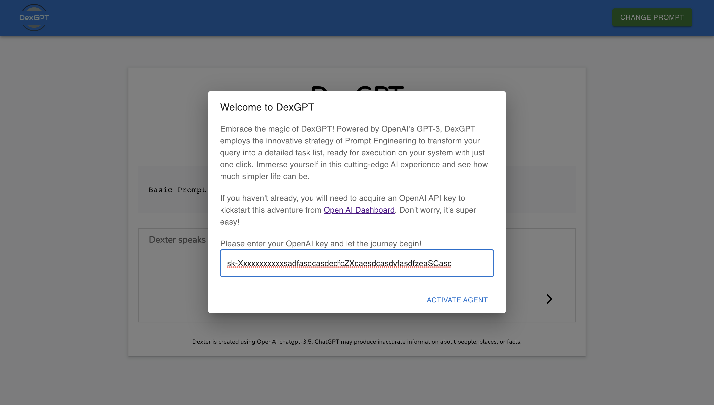
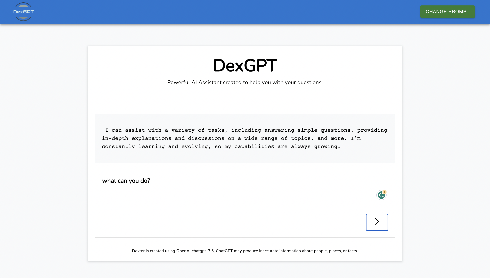
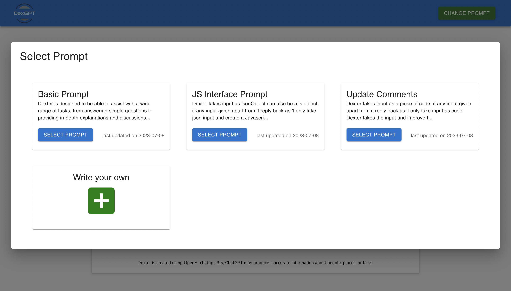
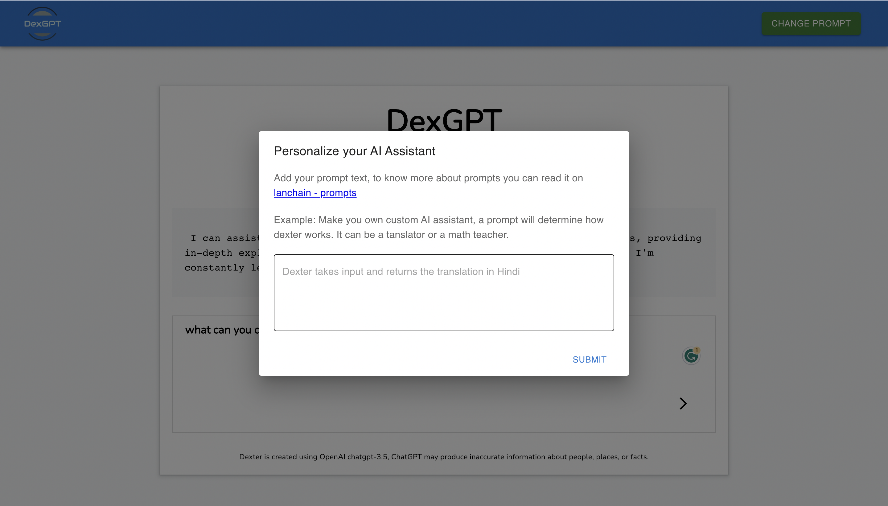

# DexGPT.app

DexGPT.app is a powerful AI assistant with custom propmpting options. DexGPT.app works on [Dexter API's](https://dexgpt.gitbook.io/dexgpt-apis/).

The final version of DexGPT.app will be able to collect information from multiple provided source ( could be website or slack or gmail ), process the information and take action.

The aim of DexGPT.app is to create a powerful AI Assistant which anyone could use it as their Personal Assistant. The personal Assistant will have option to add Multiple prompt with multiple tool.

- [Read about prompts](https://docs.langchain.com/docs/components/prompts/)
- [Read about tools](https://python.langchain.com/docs/modules/agents/tools/integrations/apify)

# Build

```npm run build```

# Run

```npm start```

# Demo 

https://dexgpt.app

### Create instance using Open AI Key

Initlise Dexter with Open AI key



### Start talking to Dexter

Once instance is initlised, you can start asking query from dexter



### Change how dexter should behave.

Change how dexter should behave by changing prompt for dexter model. Select from a list of avalible prompts.



### Write custom prompt for your assistant.

You can also write your own custom prompt for your Assistant.



# Product Roadmap

- **Release 0.1.0** : First version with options to create a Dexter AI instance with conversational memory and Prompting, User does get the option to change prompt or create their own. **( By end of july )** - `In Progress`

- **Release 0.2.0** : Add Options to attach AI Tools with prompts

- **Release 0.3.0** : Add Options to attach multiple prompts.

- **Release 0.4.0** : User can create their private collection of Prompts. 

- **Release 0.5.0** : User can create a collection with multiple prompts and tools and can public for public usage.


